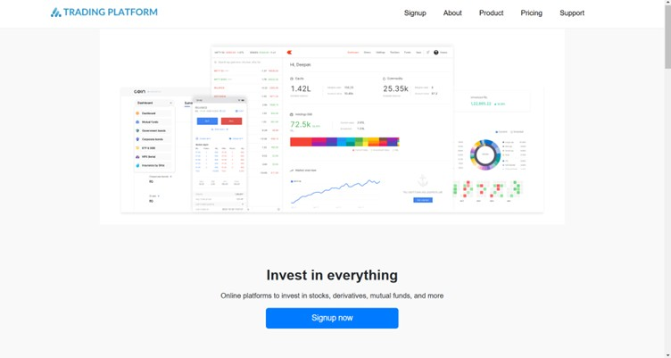
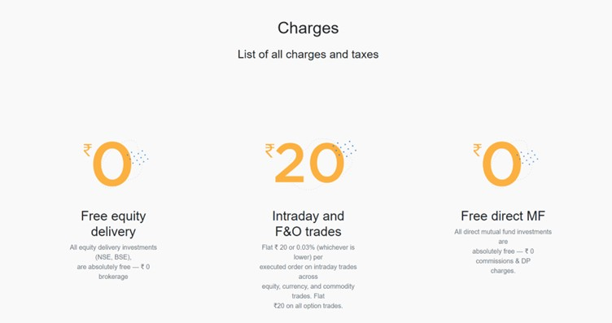
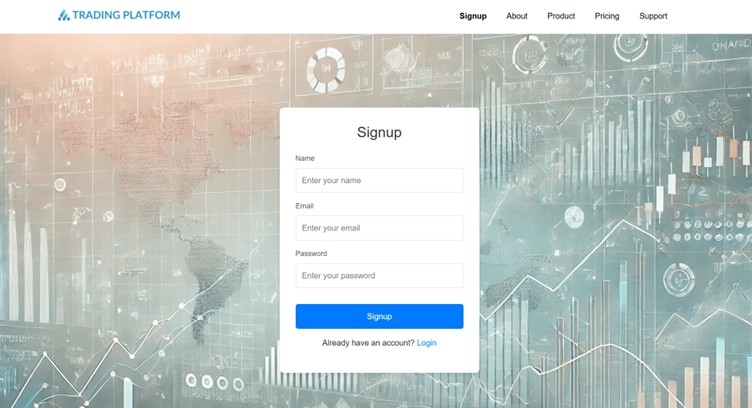
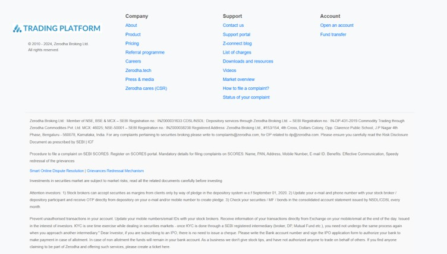
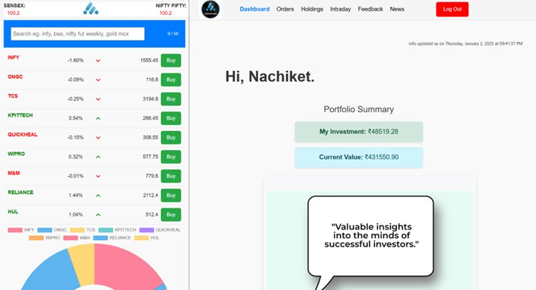
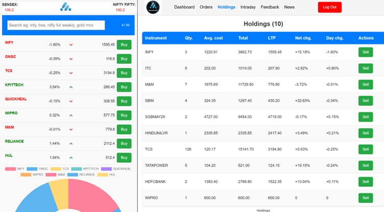
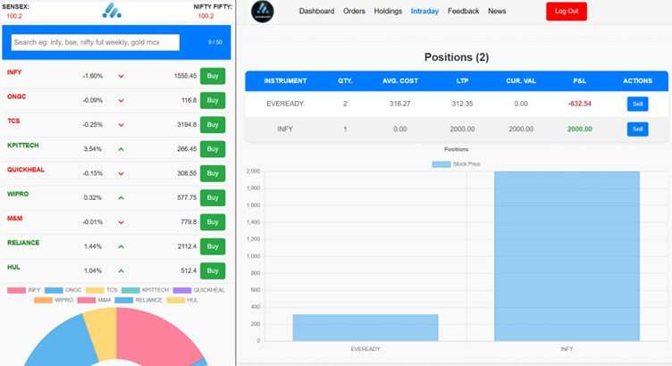
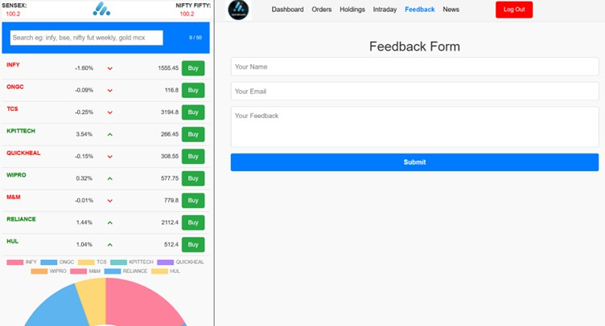
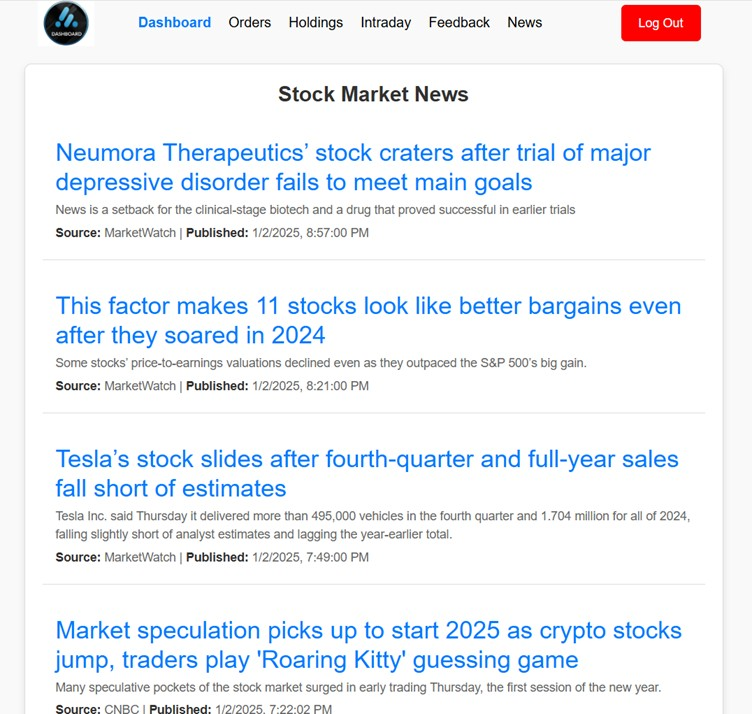

# Welcome to Trading Plarform Website!  

## Table of Contents
1. [Problem Statement](#Problem Statement)
2. [Technologies Packages & Libraries Used](#technologies)
3. [Features](#features)
4. [Screenshots](#demo--screenshots)
5. [Acknowledgments](#acknowledgments)

---

## Problem Statement
The goal of this project is to predict, based on historical data, how many days it will take for a patient to be readmitted to the hospital after receiving treatment. The predictions are made for timeframes of 7 Days, 30 Days, 60 Days, and 90 Days.

We address two specific scenarios:

1. Patient Readmission Prediction for Specific Diseases: Predicting readmission intervals for patients with particular conditions.
2. Patient Readmission Prediction for All Diseases: A generalized model for predicting readmission intervals across all conditions.

---

## Technologies
Below is a breakdown of the core technologies used in this project:

| Category     | Technology     |
|--------------|----------------|
| Web          | HTML, CSS, Bootstrap, React.js, Material UI |
| Backend      | Node.js, Express.js |
| Database     | MongoDB        |

---

### 📦 Libraries & Packages Used

---

| Package / Library    | Purpose |
| -------------------- | ------- |
| **Axios**            | HTTP client for API requests |
| **Charts.js**        | Data visualization |
| **Material UI**      | UI components |
| **React Router Dom** | Client-side routing |
| **Bootstrap 5.3**    | Responsive design |
| **CORS**             | Cross-Origin Resource Sharing (CORS) |
| **Bcrypt**           | Password hashing |
| **Jwt**              | JSON Web Token (JWT) |
| **Mongoose**         | MongoDB object modeling |
| **Express.js**       | Backend framework |
| **Body-Parser**      | Middleware for parsing request bodies |

---

## Features

**Login and Signup:** Secured with JWT Token for encryption, user authentication, and authorization.

**Stock Trading:** Users can buy and sell stocks, with updates reflected in real-time under the Holdings and Intraday sections.

**Order History:** View buy/sell history in the Orders section.

**Trading Options:** Separate options for Holdings (long-term investments) and Intraday trading.

**Real-Time News Updates:** Integrated an API for real-time news updates related to the stock market.

**Feedback Feature:** Users can share their inputs through a dedicated feedback feature.

**Frontend Design:** The frontend design is inspired by Zerodha.

**Database:** All the data is stored in MongoDB.

**Deployment:** Backend hosted on Render and Frontend on Vercel.

**Future Enhancements:** Introducing an Admin Section to manage and monitor user activities seamlessly.

---

## Screenshots

   

     

 
---

## Acknowledgments
This was coursework from Apna College.

---
