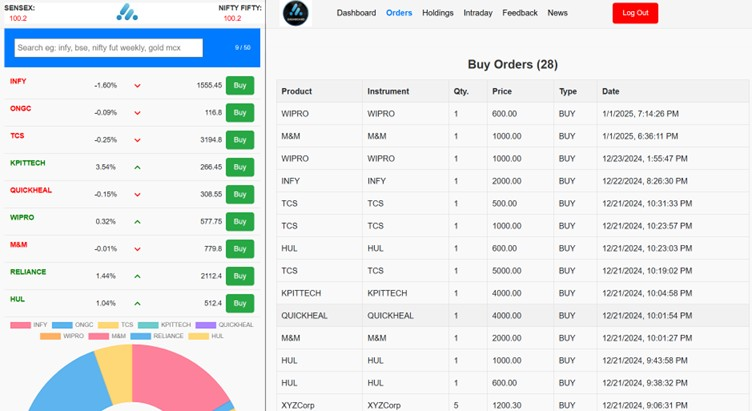

# Welcome to Trading Plarform Website!  

## Table of Contents
1. [Overview](#overview)
2. [Technologies](#technologies)
3. [Packages & Libraries Used](#packages--libraries-used)
4. [Features](#features)
5. [Demo & Screenshots](#demo--screenshots)
6. [Acknowledgments](#acknowledgments)

---

## Overview
**Description:** A clone of the popular stock trading platform, Zerodha, built using the MERN stack.

👉 𝐂𝐡𝐞𝐜𝐤 𝐢𝐭 𝐨𝐮𝐭 𝐡𝐞𝐫𝐞: https://lnkd.in/duqsBrqK

---

## Technologies
Below is a breakdown of the core technologies used in this project:

| Category     | Technology     |
|--------------|----------------|
| Web          | HTML, CSS, Bootstrap, React.js, Material UI |
| Backend      | Node.js, Express.js |
| Database     | MongoDB        |

---

## Packages & Libraries Used

| Package / Library    | Purpose |
| -------------------- | ------- |
| **Axios**            | HTTP client for API requests |
| **Charts.js**        | Data visualization |
| **Material UI**      | UI components |
| **React Router Dom** | Client-side routing |
| **Bootstrap 5.3**    | Responsive design |
| **CORS**             | Cross-Origin Resource Sharing (CORS) |
| **Bcrypt**           | Password hashing |
| **Jwt**              | JSON Web Token (JWT) |
| **Mongoose**         | MongoDB object modeling |
| **Express.js**       | Backend framework |
| **Body-Parser**      | Middleware for parsing request bodies |

---

## Features

1. **Login and Signup**: Secured with JWT Token for encryption, user authentication, and authorization.

2. **Stock Trading**: Users can buy and sell stocks, with updates reflected in real-time under the **Holdings** and **Intraday** sections.

3. **Order History**: View buy/sell history in the **Orders** section.

4. **Trading Options**: Separate options for **Holdings** (long-term investments) and **Intraday trading**.

5. **Real-Time News Updates**: Integrated an API for **real-time news updates** related to the stock market.

6. **Feedback Feature**: Users can share their inputs through a dedicated **feedback feature**.

7. **Frontend Design**: The frontend design is inspired by **Zerodha**.

8. **Database**: All the data is stored in **MongoDB**.

9. **Deployment**: Backend hosted on **Render** and Frontend on **Vercel**.

10. **Future Enhancements**: Introducing an **Admin Section** to manage and monitor user activities seamlessly.

---

## Screenshots

    

   

 

---

## Acknowledgments
Acknowledge any resources or inspirations.

---

